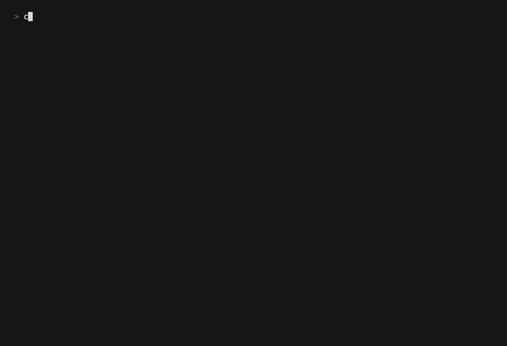

# cnspec


**Open source, cloud-native security and policy project**

cnspec assesses your entire infrastructure's security and compliance. It finds vulnerabilities and misconfigurations across public and private cloud environments, Kubernetes clusters, containers, container registries, servers, endpoints, SaaS products, infrastructure as code, APIs, and more.

A powerful policy as code engine, cnspec is built upon Mondoo's security data fabric. It comes configured with default security policies that run right out of the box. It's both fast and simple to use!

### Quick start

```bash
bash -c "$(curl -sSL https://install.mondoo.com/sh)"
cnspec scan local
```


## Installation

Install cnspec with our installation script:

**Linux and macOS**

```bash
bash -c "$(curl -sSL https://install.mondoo.com/sh)"
```

**Windows**

```powershell
Set-ExecutionPolicy Unrestricted -Scope Process -Force;
[System.Net.ServicePointManager]::SecurityProtocol = [System.Net.ServicePointManager]::SecurityProtocol -bor 3072;
iex ((New-Object System.Net.WebClient).DownloadString('https://install.mondoo.com/ps1'));
Install-Mondoo;
```

If you prefer manual installation, you can find the cnspec packages in our [releases](https://github.com/mondoohq/cnspec/releases).

## Run a scan with policies

Use the `cnspec scan` subcommand to check local and remote targets for misconfigurations and vulnerabilities.

### Local scan

This command evaluates the security of your local machine:

```bash
cnspec scan local
```

### Remote scan targets

You can also specify [remote targets](#supported-targets) to scan. For example:

```bash
# to scan a docker image:
cnspec scan docker image ubuntu:22.04

# scan public ECR registry
aws ecr-public get-login-password --region us-east-1 | docker login --username AWS --password-stdin public.ecr.aws/r6z5b8t4
cnspec scan docker image public.ecr.aws/r6z5b8t4

# to scan an AWS account using the local AWS CLI config
cnspec scan aws

# scan an EC2 instance with EC2 Instance Connect
cnspec scan aws ec2 instance-connect root@i-1234567890abcdef0

# to scan a Kubernetes cluster via your local kubectl config or a local manifest file
cnspec scan k8s
cnspec scan k8s manifest.yaml

# to scan a GitHub repository
export GITHUB_TOKEN=<personal_access_token>
cnspec scan github repo <org/repo>
```

[:books: To learn more, read the cnspec docs.](https://mondoo.com/docs/cnspec)

### Policies

cnspec policies are built on the concept of policy as code. cnspec comes with default security policies configured for all supported targets. The default policies are available in the `content` directory of this repository.

## Vulnerability scan

cnspec scans for vulnerabilities in a wide range of platforms. Vulnerability scanning is not restricted to container images; it works for build and runtime as well.



NOTE: Vulnerability scanning requires the client to be logged into Mondoo Platform.

### Examples

```bash
# scan container image
cnspec vuln docker debian:12

# scan aws instance via EC2 instance connect
cnspec vuln aws ec2 instance-connect root@i-1234567890abcdef0

# scan instance via SSH
cnspec vuln ssh user@host

# scan windows via SSH or Winrm
cnspec vuln ssh user@host --ask-pass
cnspec vuln winrm user@host --ask-pass

# scan VMware vSphere ESXi hosts
cnspec vuln vsphere user@host --ask-pass

# scan Linux, Windows
cnspec vuln local
```

| Platform                 | Versions                          |
| ------------------------ | --------------------------------- |
| Alpine                   | 3.10 - 3.24                       |
| AlmaLinux                | 8, 9, 10                          |
| Amazon Linux             | 1, 2, 2023                        |
| Arch Linux               | Rolling                           |
| CentOS                   | 6, 7, 8, Stream                   |
| Debian                   | 8, 9, 10, 11, 12, 13              |
| Fedora                   | 30 - 44                           |
| openSUSE                 | Leap 15, Leap 16                  |
| Oracle Linux             | 6, 7, 8, 9, 10                    |
| Photon Linux             | 2, 3, 4, 5                        |
| Red Hat Enterprise Linux | 6, 7, 8, 9, 10                    |
| Rocky Linux              | 8, 9, 10                          |
| SUSE Linux Enterprise    | 12, 15, 16                        |
| Ubuntu                   | 18.04, 20.04, 22.04, 24.04, 26.04 |
| VMware vSphere ESXi      | 6, 7, 8, 9                        |
| Windows                  | 10, 11, 2016, 2019, 2022, 2025    |

## cnspec interactive shell

cnspec also provides an interactive shell to explore assertions. It helps you understand the assertions that security policies use, as well as write your own policies. It's also a great way to interact with both local and remote targets on the fly.

### Local system shell

```bash
cnspec shell local
```

The shell provides a `help` command for information on the resources that power cnspec. Running `help` without any arguments lists all of the available resources and their fields. You can also run `help <resource>` to get more detail on a specific resource. For example:

```bash
cnspec> help ports
ports:              TCP/IP ports on the system
  list []port:      List of all TCP/IP ports
  listening []port: All listening ports
```

The shell uses auto-complete, which makes it easy to explore.

Once inside the shell, you can enter MQL assertions like this:

```coffeescript
> ports.listening.none( port == 23 )
```

To clear the terminal, type `clear`.

To exit, either hit CTRL + D or type `exit`.

## Prioritize risks that matter with Mondoo Platform

The Mondoo unified security platform finds and prioritizes vulnerabilities and misconfigurations that pose the highest risk to your business. Mondoo's security data fabric analyzes the threat and exposure of every finding within the unique context of your infrastructure. Instead of a flood of irrelevant security alerts, Mondoo shows you how you can make an immediate and significant impact on your security posture.

To get started, [contact us](https://mondoo.com/contact).

To learn about Mondoo Platform, read the [Mondoo Platform docs](https://mondoo.com/docs) or visit [mondoo.com](https://mondoo.com).

### Register cnspec with Mondoo Platform

To use cnspec with Mondoo Platform, [generate a token in the Mondoo App](https://mondoo.com/docs/cnspec/install/registration), then run:

```bash
cnspec login --token TOKEN
```

Once authenticated, you can scan any target:

```bash
cnspec scan <target>
```

cnspec returns the results from the scan to `STDOUT` and to Mondoo Platform.

With an account on Mondoo Platform, you can upload policies:

```bash
cnspec bundle upload mypolicy.mql.yaml
```

## Custom policies

A cnspec policy is simply a YAML file that lets you express any security rule or best practice for your fleet.

A few examples can be found in the `examples` folder in this repo. You can run any of these policies:

```bash
cnspec scan local -f examples/example.mql.yaml
```

If you're interested in writing your own policies or contributing policies back to the cnspec community, read Mondoo's [Policy Authoring Guide](https://mondoo.com/docs/cnspec/write-policies/write-intro).

## Supported targets

| Target                         | Provider                   | Example                                                                                                                                               |
| ------------------------------ | -------------------------- | ----------------------------------------------------------------------------------------------------------------------------------------------------- |
| Active Directory domains       | `activedirectory`          | `cnspec scan activedirectory --dc DC_HOSTNAME --user USER --password PASSWORD`                                                                        |
| Alibaba Cloud accounts         | `alicloud`                 | `cnspec scan alicloud --access-key-id KEY_ID --access-key-secret KEY_SECRET`                                                                          |
| Ansible playbooks              | `ansible`                  | `cnspec shell ansible YOUR_PLAYBOOK.yml`                                                                                                              |
| Apache Cassandra clusters      | `cassandra`                | `cnspec scan cassandra HOST --user USER --ask-pass`                                                                                                   |
| Arista network devices         | `arista`                   | `cnspec scan arista DEVICE_PUBLIC_IP --ask-pass`                                                                                                      |
| Atlassian organizations        | `atlassian admin`          | `cnspec shell atlassian admin --admin-token YOUR_TOKEN`                                                                                               |
| Auth0 tenants                  | `auth0`                    | `cnspec scan auth0 --domain TENANT_DOMAIN --client-id CLIENT_ID --client-secret CLIENT_SECRET`                                                        |
| AWS accounts                   | `aws`                      | `cnspec scan aws`                                                                                                                                     |
| AWS CloudFormation templates   | `cloudformation`           | `cnspec scan cloudformation cloudformation_file.json`                                                                                                 |
| AWS EC2 EBS snapshot           | `aws ec2 ebs snapshot`     | `cnspec scan aws ec2 ebs snapshot SNAPSHOTID`                                                                                                         |
| AWS EC2 EBS volume             | `aws ec2 ebs volume`       | `cnspec scan aws ec2 ebs volume VOLUMEID`                                                                                                             |
| AWS EC2 Instance Connect       | `aws ec2 instance-connect` | `cnspec scan aws ec2 instance-connect ec2-user@INSTANCEID`                                                                                            |
| AWS EC2 instances              | `ssh`                      | `cnspec scan ssh user@host`                                                                                                                           |
| Bicep files and ARM templates  | `bicep`                    | `cnspec scan bicep BICEP_FILE_OR_PATH`                                                                                                                |
| Bitwarden organizations        | `bitwarden`                | `cnspec scan bitwarden --client-id organization.UUID --client-secret CLIENT_SECRET`                                                                   |
| Block devices                  | `device`                   | `cnspec scan device --lun LOGICAL_UNIT_NUMBER`                                                                                                        |
| Check Point management servers | `checkpoint`               | `cnspec scan checkpoint --hostname HOSTNAME --api-key API_KEY`                                                                                        |
| Cisco Catalyst devices         | `ciscocatalyst`            | `cnspec scan ciscocatalyst HOSTNAME --user USER --ask-pass`                                                                                           |
| Claude AI platform accounts    | `claude`                   | `cnspec scan claude --admin-token ADMIN_API_KEY`                                                                                                      |
| ClickHouse Cloud organizations | `clickhousecloud`          | `cnspec scan clickhousecloud --organization-id ORG_ID --api-key KEY_ID --ask-secret`                                                                  |
| ClickHouse servers             | `clickhousedb`             | `cnspec scan clickhousedb HOST --user USER --ask-pass`                                                                                                |
| Cloudflare accounts            | `cloudflare`               | `cnspec scan cloudflare --token ACCESS_TOKEN`                                                                                                         |
| Confluence users               | `atlassian confluence`     | `cnspec shell atlassian confluence --host YOUR_HOST_URL --user USER --user-token YOUR_TOKEN`                                                          |
| Container images               | `container`, `docker`      | `cnspec scan container ubuntu:latest`                                                                                                                 |
| Container registries           | `container registry`       | `cnspec scan container registry index.docker.io/library/rockylinux:8`                                                                                 |
| Databricks accounts            | `databricks`               | `cnspec scan databricks --account-id ACCOUNT_ID --client-id CLIENT_ID --client-secret CLIENT_SECRET`                                                  |
| Datadog accounts               | `datadog`                  | `cnspec scan datadog --api-key API_KEY --app-key APP_KEY`                                                                                             |
| DigitalOcean accounts          | `digitalocean`             | `cnspec scan digitalocean --token API_TOKEN`                                                                                                          |
| DNS records                    | `host`                     | `cnspec scan host mondoo.com`                                                                                                                         |
| Dockerfiles                    | `docker`                   | `cnspec shell docker file FILENAME`                                                                                                                   |
| Dropbox Business teams         | `dropbox`                  | `cnspec scan dropbox --token TEAM_ACCESS_TOKEN`                                                                                                       |
| Elasticsearch clusters         | `elasticsearch`            | `cnspec scan elasticsearch HOST --user USER --ask-pass`                                                                                               |
| Equinix Metal organizations    | `equinix`                  | `cnspec scan equinix org ORG_ID --token API_TOKEN`                                                                                                    |
| F5 BIG-IP systems              | `bigip`                    | `cnspec scan bigip --hostname HOSTNAME --username USER --ask-pass`                                                                                    |
| File systems                   | `filesystem`               | `cnspec scan filesystem MOUNT_PATH`                                                                                                                   |
| FortiOS devices                | `fortios`                  | `cnspec scan fortios --hostname HOSTNAME --token API_TOKEN`                                                                                           |
| GitHub organizations           | `github org`               | `cnspec scan github org mondoohq`                                                                                                                     |
| GitHub repositories            | `github repo`              | `cnspec scan github repo mondoohq/cnspec`                                                                                                             |
| GitLab groups                  | `gitlab`                   | `cnspec scan gitlab --group mondoohq`                                                                                                                 |
| Google Cloud projects          | `gcp`                      | `cnspec scan gcp`                                                                                                                                     |
| Google Workspace               | `google-workspace`         | `cnspec scan google-workspace --customer-id CUSTOMER_ID --impersonated-user-email EMAIL --credentials-path JSON_FILE`                                 |
| Grafana organizations          | `grafana`                  | `cnspec scan grafana --url GRAFANA_URL --token API_TOKEN`                                                                                             |
| HashiCorp Cloud Platform       | `hcp`                      | `cnspec scan hcp --client-id CLIENT_ID --client-secret CLIENT_SECRET`                                                                                 |
| Helm charts                    | `helm`                     | `cnspec scan helm CHART_PATH`                                                                                                                         |
| Hetzner Cloud projects         | `hetzner`                  | `cnspec scan hetzner --token API_TOKEN`                                                                                                               |
| Hugging Face namespaces        | `huggingface`              | `cnspec scan huggingface --token API_TOKEN --namespace NAMESPACE --namespace-type org`                                                                |
| IBM Db2 databases              | `db2`                      | `cnspec scan db2 HOST --database DATABASE --user USER --ask-pass`                                                                                     |
| IoT devices                    | `opcua`                    | `cnspec shell opcua`                                                                                                                                  |
| IP address information         | `ipinfo`                   | `cnspec shell ipinfo`                                                                                                                                 |
| IPMI interfaces                | `ipmi`                     | `cnspec scan ipmi user@host`                                                                                                                          |
| Iru tenants                    | `iru`                      | `cnspec scan iru --subdomain SUBDOMAIN --token API_TOKEN`                                                                                             |
| Jamf Pro accounts              | `jamf`                     | `cnspec scan jamf --client-id CLIENT_ID --client-secret CLIENT_SECRET --instance-domain INSTANCE_URL`                                                 |
| JFrog Artifactory instances    | `artifactory`              | `cnspec scan artifactory --url ARTIFACTORY_URL --token ACCESS_TOKEN`                                                                                  |
| Jira projects                  | `atlassian jira`           | `cnspec shell atlassian jira --host YOUR_HOST_URL --user USER --user-token YOUR_TOKEN`                                                                |
| JumpCloud organizations        | `jumpcloud`                | `cnspec scan jumpcloud --api-key API_KEY`                                                                                                             |
| Juniper Junos devices          | `junos`                    | `cnspec scan junos --hostname DEVICE_IP --username USER_NAME --identity-file SSH_IDENTITY_FILE`                                                       |
| Keycloak servers               | `keycloak`                 | `cnspec scan keycloak --url KEYCLOAK_URL --realm REALM --client-id CLIENT_ID --client-secret CLIENT_SECRET`                                           |
| Kubernetes cluster nodes       | `local`, `ssh`             | `cnspec scan ssh user@host`                                                                                                                           |
| Kubernetes clusters            | `k8s`                      | `cnspec scan k8s`                                                                                                                                     |
| Kubernetes manifests           | `k8s`                      | `cnspec scan k8s manifest.yaml`                                                                                                                       |
| Kubernetes workloads           | `k8s`                      | `cnspec scan k8s --discover pods,deployments`                                                                                                         |
| Kustomize overlays             | `kustomize`                | `cnspec scan kustomize OVERLAY_PATH`                                                                                                                  |
| Linux hosts                    | `local`, `ssh`             | `cnspec scan local` or<br></br>`cnspec scan ssh user@host`                                                                                            |
| macOS hosts                    | `local`, `ssh`             | `cnspec scan local` or<br></br>`cnspec scan ssh user@IP_ADDRESS`                                                                                      |
| Microsoft 365 tenants          | `ms365`                    | `cnspec scan ms365 --tenant-id TENANT_ID --client-id CLIENT_ID --certificate-path PEM_FILE`                                                           |
| Microsoft Azure instances      | `ssh`                      | `cnspec scan ssh user@host`                                                                                                                           |
| Microsoft Azure subscriptions  | `azure`                    | `cnspec scan azure --subscription SUBSCRIPTION_ID`                                                                                                    |
| Microsoft SQL Server instances | `mssql`                    | `cnspec scan mssql HOST --user USER --ask-pass`                                                                                                       |
| MikroTik RouterOS devices      | `mikrotik`                 | `cnspec scan mikrotik user@host --ask-pass`                                                                                                           |
| Mistral AI workspaces          | `mistral`                  | `cnspec scan mistral --token API_KEY --workspace WORKSPACE_ID`                                                                                        |
| Model Context Protocol servers | `mcp`                      | `cnspec scan mcp http http://localhost:8080/mcp`                                                                                                      |
| Mondoo Platform                | `mondoo`                   | `cnspec scan mondoo`                                                                                                                                  |
| MongoDB Atlas organizations    | `mongodbatlas`             | `cnspec scan mongodbatlas --org-id ORG_ID --public-key PUBLIC_KEY --private-key PRIVATE_KEY`                                                          |
| MongoDB servers                | `mongo`                    | `cnspec scan mongo HOST --user USER --ask-pass`                                                                                                       |
| MySQL and MariaDB servers      | `mysqldb`                  | `cnspec scan mysqldb HOST --user USER --ask-pass`                                                                                                     |
| Neon organizations             | `neon`                     | `cnspec scan neon --token API_KEY`                                                                                                                    |
| Netlify accounts               | `netlify`                  | `cnspec scan netlify --token ACCESS_TOKEN`                                                                                                            |
| Network devices over SSH       | `nd-ssh`                   | `cnspec scan nd-ssh user@host --ask-pass`                                                                                                             |
| NextDNS accounts               | `nextdns`                  | `cnspec scan nextdns --api-key API_KEY`                                                                                                               |
| Nmap network scans             | `nmap`                     | `cnspec shell nmap host IP_ADDRESS`                                                                                                                   |
| Nutanix Prism Central          | `nutanix`                  | `cnspec scan nutanix --endpoint ENDPOINT --user USER --ask-pass`                                                                                      |
| Okta org                       | `okta`                     | `cnspec scan okta --token TOKEN --organization ORGANIZATION`                                                                                          |
| Ollama instances               | `ollama`                   | `cnspec scan ollama --host OLLAMA_URL`                                                                                                                |
| OpenAI accounts                | `openai`                   | `cnspec scan openai --token ADMIN_API_KEY --organization ORG_ID`                                                                                      |
| OpenSearch clusters            | `opensearch`               | `cnspec scan opensearch HOST --user USER --ask-pass`                                                                                                  |
| OpenStack projects             | `openstack`                | `cnspec scan openstack --cloud CLOUDS_YAML_ENTRY`                                                                                                     |
| Oracle Cloud Interface (OCI)   | `oci`                      | `cnspec scan oci`                                                                                                                                     |
| Oracle Database                | `oracledb`                 | `cnspec scan oracledb HOST --service SERVICE_NAME --user USER --ask-pass`                                                                             |
| PAN-OS firewalls               | `panos`                    | `cnspec scan panos --hostname HOSTNAME --username USER --ask-pass`                                                                                    |
| Portainer instances            | `portainer`                | `cnspec scan portainer PORTAINER_URL --access-token ACCESS_TOKEN`                                                                                     |
| PostgreSQL servers             | `postgresdb`               | `cnspec scan postgresdb HOST --user USER --ask-pass`                                                                                                  |
| Proxmox VE hypervisors         | `proxmox`                  | `cnspec scan proxmox --host PROXMOX_URL --token API_TOKEN`                                                                                            |
| Redfish management controllers | `redfish`                  | `cnspec scan redfish user@host --ask-pass`                                                                                                            |
| Redis and Valkey servers       | `redisdb`                  | `cnspec scan redisdb HOST --ask-pass`                                                                                                                 |
| Running containers             | `docker`                   | `cnspec scan docker CONTAINER_ID`                                                                                                                     |
| Shodan search engine           | `shodan`                   | `cnspec shell shodan`                                                                                                                                 |
| Slack team                     | `slack`                    | `cnspec scan slack --token TOKEN`                                                                                                                     |
| Snowflake accounts             | `snowflake`                | `cnspec scan snowflake --account ACCOUNT_ID --region REGION --user USER --role ROLE --token TOKEN`                                                    |
| Software dependencies          | `depsdev`                  | `cnspec scan depsdev PATH_TO_GO_MOD`                                                                                                                  |
| SSL certificates on websites   | `host`                     | `cnspec scan host mondoo.com`                                                                                                                         |
| STACKIT projects               | `stackit`                  | `cnspec scan stackit --project-id PROJECT_ID --service-account-key-path KEY_FILE`                                                                     |
| Subdomains                     | `networkdiscovery`         | `cnspec scan networkdiscovery mondoohq.com --discover subdomains`                                                                                     |
| Tailscale networks             | `tailscale`                | `cnspec scan tailscale --token ACCESS_TOKEN`                                                                                                          |
| Terraform HCL                  | `terraform`                | `cnspec scan terraform HCL_FILE_OR_PATH`                                                                                                              |
| Terraform plan                 | `terraform plan`           | `cnspec scan terraform plan plan.json`                                                                                                                |
| Terraform state                | `terraform state`          | `cnspec scan terraform state state.json`                                                                                                              |
| Together AI accounts           | `together`                 | `cnspec scan together --token API_KEY`                                                                                                                |
| Ubiquiti UniFi controllers     | `unifi`                    | `cnspec scan unifi --hostname HOSTNAME --username USER --ask-pass`                                                                                    |
| Vagrant virtual machines       | `vagrant`                  | `cnspec scan vagrant HOST`                                                                                                                            |
| Vercel accounts                | `vercel`                   | `cnspec scan vercel --token ACCESS_TOKEN`                                                                                                             |
| vLLM inference servers         | `vllm`                     | `cnspec scan vllm ENDPOINT`                                                                                                                           |
| VMware Cloud Director          | `vcd`                      | `cnspec shell vcd --user USER --host HOST --ask-pass`                                                                                                 |
| VMware vSphere                 | `vsphere`                  | `cnspec scan vsphere user@domain@host --ask-pass`                                                                                                     |
| Weaviate vector databases      | `weaviate`                 | `cnspec scan weaviate HOST --api-key API_KEY`                                                                                                         |
| Windows hosts                  | `local`, `ssh`, `winrm`    | `cnspec scan local`,<br></br>`cnspec scan ssh Administrator@IP_ADDRESS --ask-pass` or<br></br>`cnspec scan winrm Administrator@IP_ADDRESS --ask-pass` |
| Zoom accounts                  | `zoom`                     | `cnspec scan zoom --account-id ACCOUNT_ID --client-id CLIENT_ID --client-secret CLIENT_SECRET`                                                        |

## Agent skills

cnspec includes agent skills that give coding agents MQL expertise and policy navigation capabilities. Skills work across Claude Code, Cursor, Gemini CLI, and Codex.

| Skill | Description |
|-------|-------------|
| [mql](skills/mql/) | MQL query development with syntax guidance, platform-specific patterns, and schema discovery |
| [policy-graph](skills/policy-graph/) | Navigate policy bundles using graph commands — search, trace compliance mappings, explore structure |

See [skills/README.md](skills/README.md) for installation instructions and details.

## What's next?

There are so many things cnspec can do, from testing your entire fleet for vulnerabilities to gathering information and creating reports for auditors. With its custom policies, cnspec can scan any component you care about!

Explore our:

- [cnspec docs](https://mondoo.com/docs/cnspec)
- [Policy as code](https://mondoo.com/docs/cnspec/write-policies/write-intro)
- [MQL](https://github.com/mondoohq/mql), our open source, cloud-native asset inventory framework
- [MQL introduction](https://mondoohq.github.io/mql-intro/index.html)
- [MQL resource packs](https://mondoo.com/docs/mql/resources)
- [HashiCorp Packer plugin](https://github.com/mondoohq/packer-plugin-mondoo) to integrate cnspec with HashiCorp Packer!

## Join the community!

Our goal is to secure all layers of your infrastructure. If you need support or want to get involved with the development of cnspec, join our [community](https://github.com/orgs/mondoohq/discussions) today and let's grow it together!

## Development

See our [development documentation](docs/development.md) for information on building and contributing to cnspec.

## Legal

- **Copyright:** 2018-2026, Mondoo, Inc.
- **License:** BUSL 1.1
- **Authors:** Christoph Hartmann, Dominik Richter
