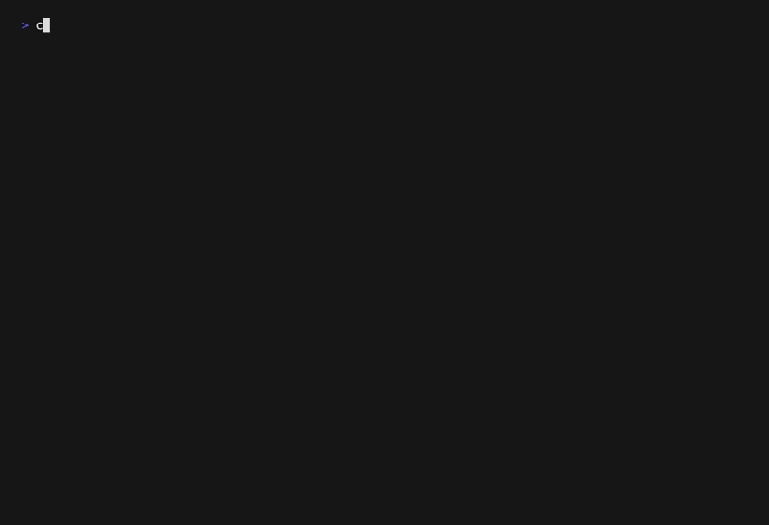

# cnspec


**Open source, cloud-native security and policy project**

cnspec assesses your entire infrastructure's security and compliance. It finds vulnerabilities and misconfigurations across public and private cloud environments, Kubernetes clusters, containers, container registries, servers, and endpoints, SaaS products, infrastructure as code, APIs, and more.

A powerful policy as code engine, cnspec is built upon [`cnquery`](https://github.com/mondoohq/cnquery). It comes configured with default security policies that run right out of the box. It's both fast and simple to use!



## Installation

Install cnspec with our installation script:

**Linux and macOS**

```bash
bash -c "$(curl -sSL https://install.mondoo.com/sh)"
```

**Windows**

```powershell
Set-ExecutionPolicy Unrestricted -Scope Process -Force;
[System.Net.ServicePointManager]::SecurityProtocol = [System.Net.ServicePointManager]::SecurityProtocol -bor 3072;
iex ((New-Object System.Net.WebClient).DownloadString('https://install.mondoo.com/ps1'));
Install-Mondoo;
```

If you prefer manual installation, you can find the cnspec packages in our [releases](https://github.com/mondoohq/cnspec/releases).

## Run a scan with policies

Use the `cnspec scan` subcommand to check local and remote targets for misconfigurations and vulnerabilities.

### Local scan

This command evaluates the security of your local machine:

```bash
cnspec scan local
```

### Remote scan targets

You can also specify [remote targets](#supported-targets) to scan. For example:

```bash
# to scan a docker image:
cnspec scan docker image ubuntu:22.04

# scan public ECR registry
aws ecr-public get-login-password --region us-east-1 | docker login --username AWS --password-stdin public.ecr.aws/r6z5b8t4
cnspec scan docker image public.ecr.aws/r6z5b8t4

# to scan an AWS account using the local AWS config
cnspec scan aws

# scan an EC2 instance with EC2 Instance Connect
cnspec scan aws ec2 instance-connect root@i-1234567890abcdef0

# to scan a Kubernetes cluster via your local kubectl config or a local manifest file
cnspec scan k8s
cnspec scan k8s manifest.yaml

# to scan a GitHub repository
export GITHUB_TOKEN=<personal_access_token>
cnspec scan github repo <org/repo>
```

[:books: To learn more, read the cnspec docs.](https://mondoo.com/docs/cnspec/home)

### Policies

cnspec policies are built on the concept of [policy as code](https://mondoo.com/policy-as-code/). cnspec comes with default security policies configured for all supported targets. The default policies are available in the [cnspec-policies](https://github.com/mondoohq/cnspec-policies) GitHub repo.

## Vulnerability scan

cnspec scans for vulnerabilities in a wide range of platforms. Vulnerability scanning is not restricted to container images; it works for build and runtime as well.


NOTE: The current version requires you to log into Mondoo Platform. Future versions will let you scan the platforms without logging in.

### Examples

```bash
# scan container image
cnspec vuln docker debian:10

# scan aws instance via EC@ instance connect
cnspec vuln aws ec2 instance-connect root@i-1234567890abcdef0

# scan instance via SSH
cnspec vuln ssh user@host

# scan windows via SSH or Winrm
cnspec vuln ssh user@host --ask-pass
cnspec vuln winrm user@host --ask-pass

# scan VMware vSphere ESXi hosts
cnspec vuln vsphere user@host --ask-pass

# scan Linux, Windows
cnspec vuln local
```

| Platform                 | Versions                 |
| ------------------------ | ------------------------ |
| Alpine                   | 3.10 - 3.18              |
| AlmaLinux                | 8, 9                     |
| Amazon Linux             | 1, 2, 2023               |
| Arch Linux               | Rolling                  |
| CentOS                   | 6, 7                     |
| Debian                   | 8, 9, 10, 11, 12         |
| Fedora                   | 30 - 38                  |
| openSUSE                 | Leap 15                  |
| Oracle Linux             | 6, 7, 8, 9               |
| Photon Linux             | 2, 3, 4, 5               |
| Red Hat Enterprise Linux | 6, 7, 8, 9               |
| Rocky Linux              | 8, 9                     |
| SUSE Linux Enterprise    | 12, 15                   |
| Ubuntu                   | 18.04, 20.04, 22.04      |
| VMware vSphere ESXi      | 6, 7                     |
| Windows                  | 10, 11, 2016, 2019, 2022 |

## cnspec interactive shell

cnspec also provides an interactive shell to explore assertions. It helps you understand the assertions that security policies use, as well as write your own policies. It's also a great way to interact with both local and remote targets on the fly.

### Local system shell

```bash
cnspec shell local
```

The shell provides a `help` command for information on the resources that power cnspec. Running `help` without any arguments lists all of the available resources and their fields. You can also run `help <resource>` to get more detail on a specific resource. For example:

```bash
cnspec> help ports
ports:              TCP/IP ports on the system
  list []port:      List of all TCP/IP ports
  listening []port: All listening ports
```

The shell uses auto-complete, which makes it easy to explore. 

Once inside the shell, you can enter MQL assertions like this:

```coffeescript
> ports.listening.none( port == 23 )
```

To clear the terminal, type `clear`.

To exit, either hit CTRL + D or type `exit`.

## Scale cnspec across your fleet with Mondoo Platform

The easiest way to scale cnspec across your fleet is to sign up for a free Mondoo Platform account. With Mondoo Platform, you can:

- Aggregate and share reports
- Perform vulnerability scans
- Store and distribute policies from a central location
- Set custom policy exceptions
- Explore the relationships between the different assets in your infrastructure

Mondoo Platform's web-based console allows you to navigate, search, and arrange all of your reports. The platform is designed for multi-tenancy and provides a secure, private environment that keeps data about your assets in your own account. With the platform, you can assess all your assets based on consistent policies and define custom policies and exceptions for your fleet.

Go to [console.mondoo.com](https://console.mondoo.com/space/integrations/add/mondoo/setup) to sign up.

To learn about Mondoo Platform, read the [Mondoo Platform docs](https://mondoo.com/docs/platform/home) or visit [mondoo.com](https://www.mondoo.com).

### Register cnspec with Mondoo Platform

To use cnspec with Mondoo Platform, [generate a token in the Mondoo Console](https://mondoo.com/docs/cnspec/cnspec-platform/), then run:

```bash
cnspec login --token TOKEN
```

Once authenticated, you can scan any target:

```bash
cnspec scan <target>
```

cnspec returns the results from the scan to `STDOUT` and to Mondoo Platform.

With an account on Mondoo Platform, you can upload policies:

```bash
cnspec bundle upload mypolicy.mql.yaml
```

## Custom policies

A cnspec policy is simply a YAML file that lets you express any security rule or best practice for your fleet.

A few examples can be found in the `examples` folder in this repo. You can run any of these policies:

```bash
cnspec scan local -f examples/example.mql.yaml
```

If you're interested in writing your own policies or contributing policies back to the cnspec community, read Mondoo's [Policy Authoring Guide](https://mondoo.com/docs/cnspec/cnspec-policies/write/).

## Supported targets

| Description                      | Provider                   | Example                                                                                                                                               |
| -------------------------------- | -------------------------- | ----------------------------------------------------------------------------------------------------------------------------------------------------- |
| AWS accounts                     | `aws`                      | `cnspec scan aws`                                                                                                                                     |
| AWS EC2 instances                | `ssh`                      | `cnspec scan ssh user@host`                                                                                                                           |
| AWS EC2 Instance Connect         | `aws ec2 instance-connect` | `cnspec scan aws ec2 instance-connect ec2-user@INSTANCEID`                                                                                            |
| AWS EC2 EBS snapshot             | `aws ec2 ebs snapshot`     | `cnspec scan aws ec2 ebs snapshot SNAPSHOTID`                                                                                                         |
| AWS EC2 EBS volume               | `aws ec2 ebs volume`       | `cnspec scan aws ec2 ebs volume VOLUMEID`                                                                                                             |
| Container images                 | `container`, `docker`      | `cnspec scan container ubuntu:latest`                                                                                                                 |
| Container registries             | `container registry`       | `cnspec scan container registry index.docker.io/library/rockylinux:8 `                                                                                |
| DNS records                      | `host`                     | `cnspec scan host mondoo.com`                                                                                                                         |
| GitHub organizations             | `github org`               | `cnspec scan github org mondoohq`                                                                                                                     |
| GitHub repositories              | `github repo`              | `cnspec scan github repo mondoohq/cnspec`                                                                                                             |
| GitLab groups                    | `gitlab`                   | `cnspec scan gitlab --group mondoohq`                                                                                                                 |
| Google Cloud projects            | `gcp`                      | `cnspec scan gcp`                                                                                                                                     |
| Google Workspace                 | `google-workspace`         | `cnspec shell google-workspace --customer-id CUSTOMER_ID --impersonated-user-email EMAIL --credentials-path JSON_FILE`                                |
| Kubernetes cluster nodes         | `local`, `ssh`             | `cnspec scan ssh user@host`                                                                                                                           |
| Kubernetes clusters              | `k8s`                      | `cnspec scan k8s`                                                                                                                                     |
| Kubernetes manifests             | `k8s`                      | `cnspec scan k8s manifest.yaml `                                                                                                                      |
| Kubernetes workloads             | `k8s`                      | `cnspec scan k8s --discover pods,deployments`                                                                                                         |
| Linux hosts                      | `local`, `ssh`             | `cnspec scan local` or<br></br>`cnspec scan ssh user@host`                                                                                            |
| macOS hosts                      | `local`, `ssh`             | `cnspec scan local` or<br></br>`cnspec scan ssh user@IP_ADDRESS`                                                                                      |
| Microsoft 365 accounts           | `ms365`                    | `cnspec scan ms365 --tenant-id TENANT_ID --client-id CLIENT_ID --certificate-path PFX_FILE`                                                           |
| Microsoft Azure subscriptions    | `azure`                    | `cnspec scan azure --subscription SUBSCRIPTION_ID`                                                                                                    |
| Microsoft Azure virtual machines | `ssh`                      | `cnspec scan ssh user@host`                                                                                                                           |
| Oracle Cloud Infrastructure (OCI) | `oci`                     | `cnspec shell oci`                                                                                              |
| Okta                             | `okta`                     | `cnspec shell okta --token TOKEN --organization ORGANIZATION`                                                                                         |
| Running containers               | `docker`                   | `cnspec scan docker CONTAINER_ID`                                                                                                                     |
| Slack                            | `slack`                    | `cnspec shell slack --token TOKEN`                                                                                                                    |
| SSL certificates on websites     | `host`                     | `cnspec scan host mondoo.com`                                                                                                                         |
| Terraform HCL                    | `terraform`                | `cnspec scan terraform HCL_FILE_OR_PATH`                                                                                                              |
| Terraform plan                   | `terraform plan`           | `cnspec scan terraform plan plan.json`                                                                                                                |
| Terraform state                  | `terraform state`          | `cnspec scan terraform state state.json`                                                                                                              |
| Vagrant virtual machines         | `vagrant`                  | `cnspec scan vagrant HOST`                                                                                                                            |
| VMware vSphere                   | `vsphere`                  | `cnspec scan vsphere user@domain@host --ask-pass`                                                                                                     |
| Windows hosts                    | `local`, `ssh`, `winrm`    | `cnspec scan local`<br></br>`cnspec scan ssh Administrator@IP_ADDRESS --ask-pass`<br></br>`cnspec scan winrm Administrator@IP_ADDRESS --ask-pass` |

## What's next?

There are so many things cnspec can do, from testing your entire fleet for vulnerabilities to gathering information and creating reports for auditors. With its custom policies, cnspec can scan any component you care about!

Explore our:

- [cnspec docs](https://mondoo.com/docs/cnspec/home)
- [Policy bundles](https://github.com/mondoohq/cnspec-policies)
- [Policy as code](https://mondoo.com/docs/platform/console/policy_hub/)
- [MQL introduction](https://mondoohq.github.io/mql-intro/index.html)
- [MQL resource packs](https://mondoo.com/docs/mql/resources/)
- [cnquery](https://github.com/mondoohq/cnquery), our open source, cloud-native asset inventory tool
- [HashiCorp Packer plugin](https://github.com/mondoohq/packer-plugin-mondoo) to integrate cnspec with HashiCorp Packer!

## Join the community!

Our goal is to secure all layers of your infrastructure. If you need support or want to get involved with the development of cnspec, join our [community](https://github.com/orgs/mondoohq/discussions) today and let's grow it together!

## Development

See our [development docs](docs/development.md) for information on building and contributing to cnspec.

## Legal

- **Copyright:** 2018-2023, Mondoo, Inc.
- **License:** MPLv2
- **Authors:** Christoph Hartmann, Dominik Richter
