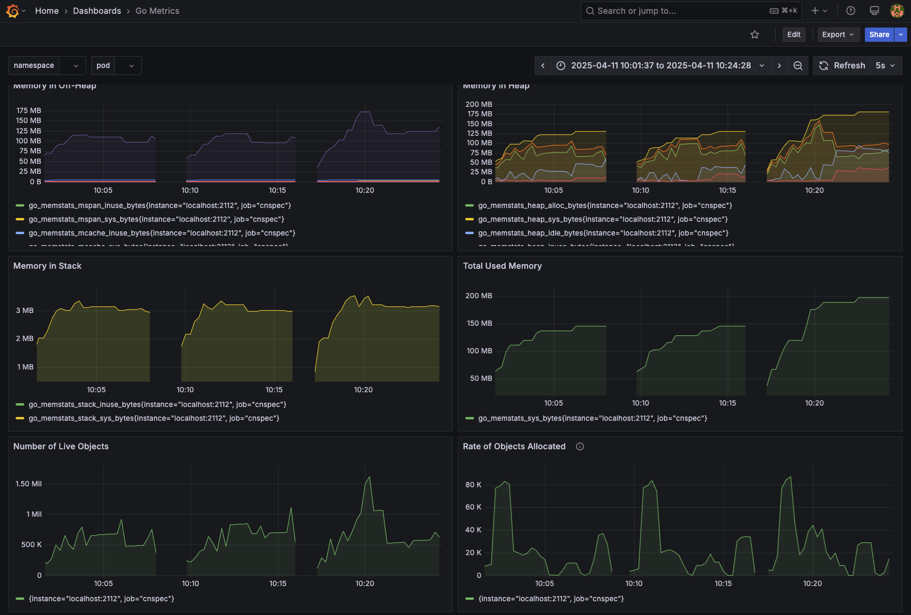

# Development

## Build

### Prerequisites

Before building from source, be sure to install:

- [Go 1.22.0+](https://go.dev/dl/)
- [Protocol Buffers v29+](https://github.com/protocolbuffers/protobuf/releases)

On macOS systems with Homebrew, run: `brew install go@1.22 protobuf`

## Install from source

1. Verify that you have Go 1.22+ installed:

    ```
    $ go version
    ```

If `go` is not installed or an older version exists, follow instructions on [the Go website](https://go.dev/doc/install).

2. Clone this repository:

   ```sh
   $ git clone https://github.com/mondoohq/cnspec.git
   $ cd cnspec
   ```

3. Build and install:

    #### Unix-like systems
    ```sh
    # To install cnspec using Go into the $GOBIN directory:
    make cnspec/install
    ```

## Develop cnspec

Whenever you change protos or other auto-generated files, you must regenerate files for the compiler. To do this, be sure you have the necessary tools installed (such as protobuf):

```bash
make prep
```

You also need to have the required dependencies present:

```bash
make prep/repos
```

When the repo is already present and something changed upstream, update the dependencies:

```bash
make prep/repos/update
```

Then, whenever you make changes, just run:

```bash
make cnspec/generate
```

This generates and updates all required files for the build. At this point you can `make cnspec/install` again as outlined above.

## Metrics (Prometheus + Grafana)

When debugging `cnspec`, you can monitor and profile memory and CPU usage using [Prometheus](https://prometheus.io/) and [Grafana](https://grafana.com/). The setup provides visibility into application performance metrics and allows us to diagnose bottlenecks, memory leaks, and high CPU usage.

**How it works?**

* Prometheus: Scrapes and stores time series metrics from your application.
* Grafana: Visualizes the metrics and allows creating dashboards and alerts.
* `cnspec` in `DEBUG` mode: Exposes basic metrics

### Setup

1. Install `prometheus` from https://prometheus.io/download/ (macOS: `brew install prometheus`)
1. Start both, Prometheus and Grafana with `make metrics/start`
1. **(one time only)** Create a Grafana Dashboard  
    1. Open Grafana at <!-- markdown-link-check-disable --> http://localhost:3000 <!-- markdown-link-check-enable -->  
    1. Add Prometheus as a data source (URL: `http://host.docker.internal:9009`)  
    1. Use an existing Go profiling dashboard from [Grafana](https://grafana.com/grafana/dashboards/) dashboards e.g. [10826](https://grafana.com/grafana/dashboards/10826-go-metrics/)  
1. Run `cnspec` with `DEBUG=1` e.g. `DEBUG=1 cnspec scan local`

You should start seeing data in Grafana!



## Contribute changes

### Mark PRs with emojis

We love emojis in our commits. These are their meanings:

🛑 breaking 🐛 bugfix 🧹 cleanup/internals ⚡ speed 📄 docs  
✨⭐🌟🌠 smaller or larger features 🐎 race condition  
🌙 MQL 🌈 visual 🟢 fix tests 🎫 auth 🦅 falcon 🐳 container  

